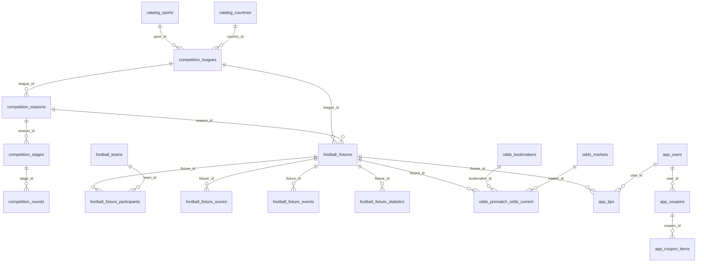

# Task 1 - PostgreSQL Target Schema and Migration Strategy

Branch: `task/001-postgresql-schema-plan`

## Goal

Move the current PreOdds data model from the legacy EF/MySQL shape to a PostgreSQL schema that matches SportMonks API v3 and can serve both web and mobile clients.

This task is documentation and architecture only. No PostgreSQL provider, migrations, or runtime sync code is added in this task.

## Inputs Reviewed

- Current EF entities under `PreOddsApi.Entities/PreOddsEntities`
- Current EF mappings under `PreOddsApi.DataLayer/Mapping`
- Current DbContext: `PreOddsApi.DataLayer/PreOddsApiDbContext.cs`
- Current workers for SportMonks core, football fixture, and odds sync
- SportMonks API v3 docs:
  - https://docs.sportmonks.com/v3/welcome/differences-between-api-2-and-api-3/api-changes
  - https://docs.sportmonks.com/v3/api/syntax
  - https://docs.sportmonks.com/v3/api/request-options/filtering
  - https://docs.sportmonks.com/v3/tutorials-and-guides/tutorials/introduction/pagination
  - https://docs.sportmonks.com/v3/tutorials-and-guides/tutorials/livescores-and-fixtures/fixtures
  - https://docs.sportmonks.com/v3/endpoints-and-entities/endpoints/livescores
  - https://docs.sportmonks.com/v3/odds-api/getting-started/endpoints/pre-match-odds

## SportMonks v3 Model Decisions

### Participants replace local/visitor team columns

SportMonks v3 replaced `localTeam` and `visitorTeam` with `participants`. Team role is held in participant metadata, such as `home` and `away`.

Decision:

- Do not model `local_team_id` and `visitor_team_id` as primary fixture concepts.
- Store teams in `football.fixture_participants`.
- Expose `home_team` and `away_team` as API projections or database views when useful.

### Scores are included data

SportMonks v3 does not return fixture scores in the default fixture response. Scores must be requested with the `scores` include.

Decision:

- Do not store duplicated score fields directly on `football.fixtures`.
- Store scores in `football.fixture_scores`.
- Optionally expose current/half/full-time scores with a read model.

### Pagination uses `has_more`

SportMonks v3 pagination uses `has_more` and `next_page`; `filters=populate` can raise the page size for initial data loading, but disables includes.

Decision:

- Sync cursors must store `next_page`, `has_more`, page number, query hash, and last successful run.
- Initial populate jobs and enrichment jobs must be separate.

### Rate limit is entity based

Rate limit is now based on entity usage rather than one global endpoint bucket.

Decision:

- Track API calls in `sync.api_requests`.
- Track per-job cursor state in `sync.sync_cursors`.
- Design sync jobs around entity groups: fixtures, teams, leagues, odds, livescores.

### Odds and core are separate domains

SportMonks v3 has separate Core and Odds API concepts. Bookmaker IDs changed between v2 and v3, while `legacy_id` exists for migration.

Decision:

- Store v3 bookmaker ID as primary external ID.
- Store `legacy_id` for mapping historical data.
- Separate current odds from odds history.

### Missing statistics are not zero

SportMonks v3 omits statistics that were not recorded; absence does not always mean zero.

Decision:

- Store statistics as typed rows.
- Do not fill absent stats with `0`.
- Use `NULL` or absence depending on the query use case.

## Problems in the Current Database Shape

1. `BaseEntity` has both `id` and `sportmonks_id`, but EF uses `sportmonks_id` as key while services often query `id`.
2. Fixture stores home/away teams as fixed columns; this is not aligned with v3 `participants`.
3. Fixture stores denormalized half-time/full-time score columns; v3 scores are typed rows.
4. Odds are stored as a flat current-state table; historical odds movements are not first-class.
5. `odd_analysis` stores many time windows as columns, making future analysis windows expensive to add.
6. Sync metadata is missing: no reliable request audit, cursor state, raw payload archive, or rate-limit evidence.
7. Config and secrets were mixed into source/config files before git initialization; this has been addressed in the baseline commit by ignoring config files and replacing hardcoded source secrets with environment variable placeholders.
8. The current schema mixes provider-owned data and app-owned data without clear ownership boundaries.

## Target PostgreSQL Schemas

```text
catalog      external reference data: sports, countries, states, types
competition  leagues, seasons, stages, rounds, groups, standings
football     teams, players, fixtures, fixture detail data
odds         bookmakers, markets, current odds, odds history
analytics    calculated analysis snapshots and read models
app          users, tips, coupons, favorites, notifications
sync         sync jobs, cursors, API call audit, raw payloads
```

## ID Strategy

### Provider-owned tables

Tables primarily owned by SportMonks use:

- `id bigint primary key`: SportMonks v3 ID
- `legacy_id bigint null`: only when SportMonks provides it or old data needs mapping
- `created_at timestamptz not null default now()`
- `updated_at timestamptz not null default now()`
- `last_synced_at timestamptz null`
- `raw_payload_id uuid null`: optional link to `sync.raw_payloads`

Examples:

- `football.fixtures.id`
- `football.teams.id`
- `competition.leagues.id`
- `odds.bookmakers.id`

### App-owned tables

Tables owned by PreOdds use:

- `id uuid primary key default gen_random_uuid()`
- foreign keys to provider-owned tables where needed
- `created_at timestamptz not null default now()`
- `updated_at timestamptz not null default now()`

Examples:

- `app.users.id`
- `app.tips.id`
- `app.coupons.id`

## Target Table List

### catalog

| Table | Purpose |
| --- | --- |
| `catalog.sports` | SportMonks sports |
| `catalog.types` | v3 typed metadata used by events, scores, stats, positions |
| `catalog.states` | Fixture state/status definitions |
| `catalog.continents` | Continents |
| `catalog.continent_translations` | Localized continent names |
| `catalog.countries` | Countries |
| `catalog.country_translations` | Localized country names |
| `catalog.regions` | Country regions |
| `catalog.cities` | Cities |

### competition

| Table | Purpose |
| --- | --- |
| `competition.leagues` | Leagues and cups |
| `competition.seasons` | Seasons per league |
| `competition.stages` | Season stages |
| `competition.groups` | Stage/season groups |
| `competition.rounds` | Stage rounds |
| `competition.aggregates` | Aggregate tie data |
| `competition.standings` | Standing rows by league/season/stage/group |
| `competition.standing_details` | Typed standing detail rows |
| `competition.standing_rules` | Standing rules |
| `competition.standing_forms` | Recent form |
| `competition.top_scorers` | Top scorer table by league/season/stage |

### football

| Table | Purpose |
| --- | --- |
| `football.teams` | Teams/participants |
| `football.team_rivals` | Team rival relationships |
| `football.team_squads` | Team squad membership |
| `football.players` | Players |
| `football.coaches` | Coaches |
| `football.referees` | Referees |
| `football.venues` | Venues |
| `football.fixtures` | Base fixture data |
| `football.fixture_participants` | Teams participating in a fixture with metadata |
| `football.fixture_scores` | Typed score rows |
| `football.fixture_periods` | Match periods |
| `football.fixture_events` | Goals, cards, substitutions, VAR, etc. |
| `football.fixture_statistics` | Typed stats rows |
| `football.fixture_lineups` | Starting lineups and bench players |
| `football.fixture_formations` | Team formations per fixture |
| `football.fixture_sidelined` | Sidelined players |
| `football.fixture_tv_stations` | Fixture broadcast links |
| `football.tv_stations` | TV station reference data |
| `football.fixture_commentaries` | Commentary rows |
| `football.fixture_comments` | Comments/news-like rows if kept |
| `football.fixture_highlights` | Highlight/video rows |
| `football.fixture_trends` | Trend data |
| `football.news` | News items |
| `football.news_lines` | News line details |
| `football.fixture_weather_reports` | Weather for fixtures |
| `football.transfers` | Player transfer data |

### odds

| Table | Purpose |
| --- | --- |
| `odds.bookmakers` | Bookmaker reference data with `legacy_id` |
| `odds.markets` | Market reference data with `legacy_id` |
| `odds.prematch_odds_current` | Latest prematch odds by fixture/bookmaker/market/outcome |
| `odds.prematch_odds_history` | Immutable prematch odds snapshots |
| `odds.inplay_odds_current` | Latest inplay odds |
| `odds.inplay_odds_history` | Immutable inplay odds snapshots |

### analytics

| Table | Purpose |
| --- | --- |
| `analytics.odd_analysis_snapshots` | Normalized win/earning stats by date, bookmaker, market, outcome, window |
| `analytics.fixture_signals` | Derived fixture-level analysis signals |
| `analytics.hot_rate_results` | Dropped (migration 015) — `/signals` reads `analytics.fixture_signals` directly |
| `analytics.winning_rate_results` | Dropped (migration 015) |
| `analytics.earning_rate_results` | Dropped (migration 015) |
| `analytics.season_team_stats` | Season/team aggregate statistics |

### app

| Table | Purpose |
| --- | --- |
| `app.users` | PreOdds users |
| `app.tips` | User tips linked to odds/fixture |
| `app.coupons` | User coupons |
| `app.coupon_items` | Coupon selections |
| `app.featured_fixtures` | Manually or analytically selected fixtures of day |
| `app.favorites` | User favorite teams/leagues/fixtures |
| `app.notifications` | Web/mobile notifications |
| `app.contact_messages` | Contact form messages |

### sync

| Table | Purpose |
| --- | --- |
| `sync.sync_jobs` | Registered jobs and schedule metadata |
| `sync.sync_cursors` | Per-job pagination and incremental cursors |
| `sync.api_requests` | SportMonks request audit, entity rate-limit fields, response status |
| `sync.raw_payloads` | Raw SportMonks response archive in `jsonb` |
| `sync.entity_versions` | Optional entity hash/version tracking for change detection |

## Core ERD



## Important Table Shapes

### football.fixtures

```sql
create table football.fixtures (
    id bigint primary key,
    sport_id bigint not null references catalog.sports(id),
    league_id bigint not null references competition.leagues(id),
    season_id bigint null references competition.seasons(id),
    stage_id bigint null references competition.stages(id),
    group_id bigint null references competition.groups(id),
    aggregate_id bigint null references competition.aggregates(id),
    round_id bigint null references competition.rounds(id),
    state_id bigint null references catalog.states(id),
    venue_id bigint null references football.venues(id),
    name text null,
    result_info text null,
    leg text null,
    details text null,
    length_minutes integer null,
    placeholder boolean not null default false,
    has_odds boolean not null default false,
    has_premium_odds boolean not null default false,
    starting_at timestamptz not null,
    last_processed_at timestamptz null,
    last_synced_at timestamptz null,
    created_at timestamptz not null default now(),
    updated_at timestamptz not null default now()
);
```

### football.fixture_participants

```sql
create table football.fixture_participants (
    fixture_id bigint not null references football.fixtures(id),
    team_id bigint not null references football.teams(id),
    location text not null,
    winner boolean null,
    position integer null,
    raw_meta jsonb null,
    primary key (fixture_id, team_id)
);
```

### football.fixture_scores

```sql
create table football.fixture_scores (
    id bigint primary key,
    fixture_id bigint not null references football.fixtures(id),
    type_id bigint null references catalog.types(id),
    participant_id bigint null references football.teams(id),
    description text null,
    goals integer null,
    participant_location text null,
    raw_score jsonb null,
    created_at timestamptz not null default now(),
    updated_at timestamptz not null default now()
);
```

### odds.prematch_odds_current

```sql
create table odds.prematch_odds_current (
    id bigint primary key,
    fixture_id bigint not null references football.fixtures(id),
    bookmaker_id bigint not null references odds.bookmakers(id),
    market_id bigint not null references odds.markets(id),
    outcome_key text not null,
    label text null,
    original_label text null,
    value numeric(12,4) null,
    probability numeric(9,4) null,
    fractional text null,
    american integer null,
    total text null,
    handicap text null,
    participants text null,
    winning boolean null,
    stopped boolean null,
    latest_bookmaker_update timestamptz null,
    captured_at timestamptz not null default now(),
    raw_payload_id uuid null,
    unique (fixture_id, bookmaker_id, market_id, outcome_key)
);
```

### odds.prematch_odds_history

```sql
create table odds.prematch_odds_history (
    id uuid primary key default gen_random_uuid(),
    sportmonks_odd_id bigint null,
    fixture_id bigint not null references football.fixtures(id),
    bookmaker_id bigint not null references odds.bookmakers(id),
    market_id bigint not null references odds.markets(id),
    outcome_key text not null,
    value numeric(12,4) null,
    probability numeric(9,4) null,
    stopped boolean null,
    winning boolean null,
    latest_bookmaker_update timestamptz null,
    captured_at timestamptz not null default now(),
    raw_payload_id uuid null
);
```

### analytics.odd_analysis_snapshots

```sql
create table analytics.odd_analysis_snapshots (
    id uuid primary key default gen_random_uuid(),
    as_of_date date not null,
    bookmaker_id bigint not null references odds.bookmakers(id),
    market_id bigint not null references odds.markets(id),
    outcome_key text not null,
    window_code text not null,
    win_count integer not null default 0,
    lost_count integer not null default 0,
    sample_count integer generated always as (win_count + lost_count) stored,
    winning_percent numeric(9,4) null,
    earning_percent numeric(9,4) null,
    created_at timestamptz not null default now(),
    unique (as_of_date, bookmaker_id, market_id, outcome_key, window_code)
);
```

## Index Plan

Required indexes:

```sql
create index ix_fixtures_starting_at on football.fixtures (starting_at);
create index ix_fixtures_league_starting_at on football.fixtures (league_id, starting_at);
create index ix_fixtures_state_starting_at on football.fixtures (state_id, starting_at);
create index ix_fixture_participants_team on football.fixture_participants (team_id);
create index ix_fixture_scores_fixture_type on football.fixture_scores (fixture_id, type_id);
create index ix_fixture_events_fixture_minute on football.fixture_events (fixture_id, minute, extra_minute);
create index ix_fixture_statistics_fixture_type on football.fixture_statistics (fixture_id, type_id);
create index ix_odds_current_fixture_bookmaker_market on odds.prematch_odds_current (fixture_id, bookmaker_id, market_id);
create index ix_odds_history_lookup on odds.prematch_odds_history (fixture_id, bookmaker_id, market_id, captured_at desc);
create index ix_analytics_odd_snapshots_lookup on analytics.odd_analysis_snapshots (as_of_date, bookmaker_id, market_id, window_code);
create index ix_api_requests_job_started_at on sync.api_requests (sync_job_id, started_at desc);
```

Recommended JSONB indexes:

```sql
create index ix_raw_payloads_payload_gin on sync.raw_payloads using gin (payload);
```

## Old to New Table Mapping

| Current table/entity | Target table/view | Action |
| --- | --- | --- |
| `aggregate` | `competition.aggregates` | Dropped (migration 015) |
| `assistscorer` | `football.fixture_assist_scorers` or event projection | Prefer event/stat projection; keep table only if API needs it |
| `bench` | `football.fixture_lineups` | Merge with lineup using `is_starter=false` |
| `bookmaker` | `odds.bookmakers` | Keep with `legacy_id` |
| `cardscorer` | `football.fixture_card_scorers` or event projection | Prefer event projection |
| `city` | `catalog.cities` | Keep, rename |
| `coach` | `football.coaches` | Keep, rename |
| `comment` | `football.fixture_comments` | Dropped (migration 015) |
| `commentary` | `football.fixture_commentaries` | Keep, rename |
| `continent` | `catalog.continents` | Keep, rename |
| `continent_locale` | `catalog.continent_translations` | Dropped (migration 015) |
| `corner` | `football.fixture_statistics` | Replace with typed statistic rows |
| `country` | `catalog.countries` | Keep, rename |
| `country_locale` | `catalog.country_translations` | Dropped (migration 015) |
| `events` | `football.fixture_events` | Keep, rename |
| `fixture` | `football.fixtures` plus child tables | Split participants/scores/periods/stats out |
| `formation` | `football.fixture_formations` | Keep, rename |
| `goalscorer` | `football.fixture_goal_scorers` or event projection | Prefer event projection |
| `group` | `competition.groups` | Keep, rename |
| `highlight` | `football.fixture_highlights` | Dropped (migration 015) |
| `league` | `competition.leagues` | Keep, rename |
| `lineup` | `football.fixture_lineups` | Keep, merge with bench |
| `market` | `odds.markets` | Keep with `legacy_id` |
| `news` | `football.news` | Keep if product uses news |
| `newsItemLine` | `football.news_lines` | Keep if product uses news |
| `odd` | `odds.prematch_odds_current` and `odds.prematch_odds_history` | Split current/history |
| `odd_analysis` | `analytics.odd_analysis_snapshots` | Normalize analysis windows |
| `period` | `football.fixture_periods` | Keep, rename |
| `player` | `football.players` | Keep, rename |
| `prd_coupon` | `app.coupons` | Convert ID to UUID; keep external share code |
| `prd_coupon_item` | `app.coupon_items` | Keep, reference current odds snapshot/outcome |
| `prd_fixture_of_day` | `app.featured_fixtures` | Keep as app-owned curation |
| `prd_tips` | `app.tips` | Convert ID/user ID to UUID links |
| `prd_user` | `app.users` | Convert to app-owned identity table |
| `referee` | `football.referees` and/or `football.fixture_referees` | Split if fixture assignment data is needed |
| `region` | `catalog.regions` | Keep, rename |
| `rival` | `football.team_rivals` | Keep, rename |
| `round` | `competition.rounds` | Keep, rename |
| `schedule` | no primary table; derive from rounds/fixtures | Store raw only unless required |
| `score` | `football.fixture_scores` | Keep, rename and align participant ID |
| `season` | `competition.seasons` | Keep, rename |
| `seasonstats` | `analytics.season_team_stats` | Move to analytics/read model |
| `sidelined` | `football.fixture_sidelined` | Keep, rename |
| `sport` | `catalog.sports` | Keep, rename |
| `squad` | `football.team_squads` | Keep, rename |
| `stage` | `competition.stages` | Keep, rename |
| `standing` | `competition.standings` | Keep, rename |
| `standing_detail` | `competition.standing_details` | Keep, rename |
| `standing_form` | `competition.standing_forms` | Keep, rename |
| `standing_rule` | `competition.standing_rules` | Keep, rename |
| `state` | `catalog.states` | Keep, rename |
| `statistic` | `football.fixture_statistics` | Keep, typed rows; no forced zeroes |
| `team` | `football.teams` | Keep, rename |
| `topScorer` | `competition.top_scorers` | Keep, rename |
| `transfer` | `football.transfers` | Keep if product uses transfer data |
| `trend` | `football.fixture_trends` | Keep, align period/minute/participant |
| `tvstation` | `football.tv_stations` and `football.fixture_tv_stations` | Split reference and relation |
| `types` | `catalog.types` | Keep, rename |
| `venue` | `football.venues` | Keep, rename |
| `weather_report` | `football.fixture_weather_reports` | Keep if product uses weather |

## Migration Strategy

### Phase 1 - PostgreSQL foundation

- Add PostgreSQL provider and database configuration.
- Create schemas and base extensions:
  - `pgcrypto` for `gen_random_uuid()`
  - optional `btree_gin` for JSONB-heavy queries
- Create provider-owned and app-owned base conventions.

### Phase 2 - Reference data

- Migrate `sport`, `types`, `state`, `continent`, `country`, `region`, `city`.
- Use SportMonks v3 IDs as primary keys.
- Preserve old `sportmonks_id` in mapping notes only; do not keep duplicate PK fields.

### Phase 3 - Competition data

- Migrate `league`, `season`, `stage`, `round`, `group`, `standing`.
- Re-sync from v3 where possible rather than trusting stale MySQL rows.

### Phase 4 - Fixture data

- Migrate `fixture` base rows to `football.fixtures`.
- Derive `football.fixture_participants` from old `localTeamId` and `visitorTeamId` during migration.
- Later v3 sync will replace this with participant metadata.
- Migrate scores into `football.fixture_scores`; old denormalized fixture score columns are not kept.

### Phase 5 - Odds data

- Migrate `bookmaker` and `market`.
- Map bookmaker `legacy_id` carefully because v3 bookmaker IDs changed.
- Migrate current `odd` rows into `odds.prematch_odds_current`.
- Create one initial history row per current odd if no true historical feed exists.

### Phase 6 - Analytics and app data

- Normalize `odd_analysis` into `analytics.odd_analysis_snapshots`.
- Migrate users, tips, coupons, and fixture-of-day into `app`.
- Convert app-owned numeric IDs to UUIDs with cross-reference tables during ETL.

### Phase 7 - Compatibility layer

- Create API read models or database views to preserve current API response shape while new web/mobile contracts are designed.
- Examples:
  - fixture list view with `home_team`, `away_team`, current score
  - fixture odds grouped by market/bookmaker
  - hot/winning/earning analysis views

## ETL Cross-Reference Tables

During migration, create temporary or permanent mapping tables:

```sql
create table sync.legacy_id_map (
    legacy_table text not null,
    legacy_id bigint not null,
    target_schema text not null,
    target_table text not null,
    target_id text not null,
    created_at timestamptz not null default now(),
    primary key (legacy_table, legacy_id)
);
```

Use this especially for:

- `prd_user` -> `app.users`
- `prd_coupon` -> `app.coupons`
- `prd_tips` -> `app.tips`
- v2 bookmaker IDs -> v3 bookmaker IDs

## Acceptance Criteria for Task 1

Task 1 is accepted when:

1. Target PostgreSQL schemas are defined.
2. Current tables/entities have a target mapping.
3. SportMonks v3 differences that affect the database are documented.
4. Migration phases are documented.
5. No runtime code or migration execution is performed in this task.
6. The branch contains only documentation needed for this planning task.

## Next Task Recommendation

Task 2 should create the PostgreSQL infrastructure branch:

```text
task/002-postgresql-infrastructure
```

Scope:

- Add Npgsql package.
- Add PostgreSQL DbContext configuration.
- Add Docker Compose for local PostgreSQL.
- Add initial schema migration or SQL baseline.
- Add example config files with placeholders only.
